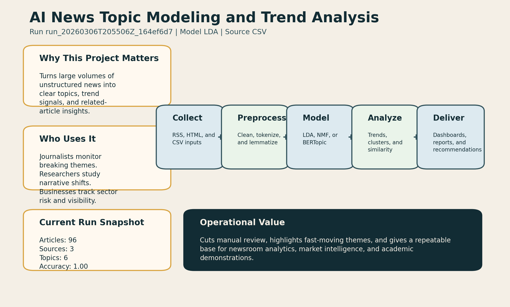
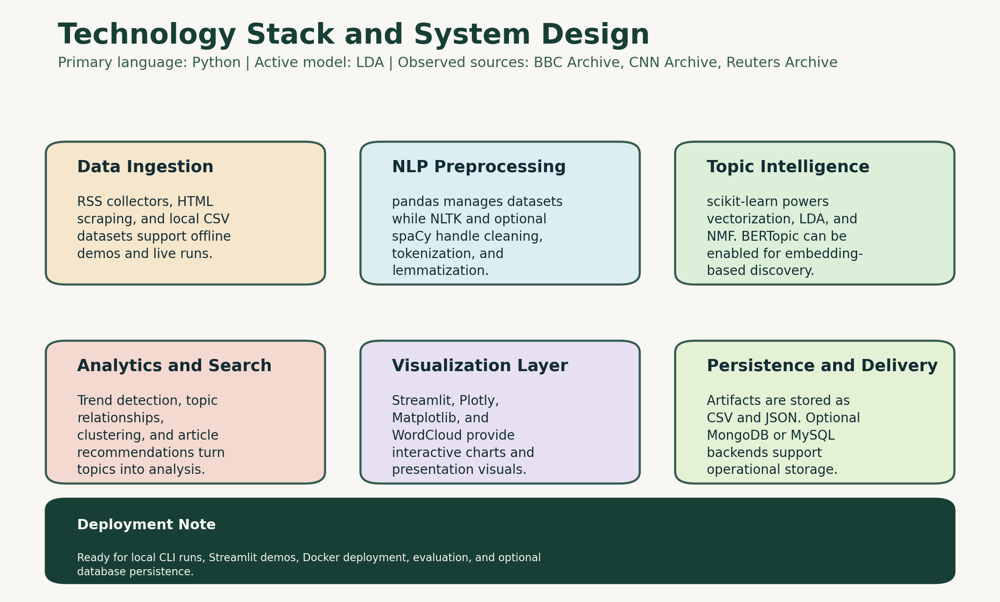

# Screenshots and Preview Assets

This page groups the visual assets used in the GitHub README and final-year-project presentation.

## Project Overview Graphic

This image summarizes the purpose of the project, the workflow, and the run snapshot generated by the pipeline.

## Technology Stack Graphic

This image explains which technologies are used across data collection, preprocessing, topic modeling, analytics, visualization, and persistence.

## How These Assets Are Generated

- The graphics are created automatically by `src/news_topic_analysis/presentation_assets.py`
- They are saved during pipeline runs inside the artifact directory
- The README copies are stored in `docs/assets/` so GitHub can render them directly

## Dashboard Areas

The Streamlit dashboard is organized into the following tabs:

- `Executive Overview`
- `Topic Intelligence`
- `Operations Review`
- `Project Brief`

These sections present topic distribution, trends, evaluation metrics, recommendations, diagnostics, and project documentation in a professional layout.
